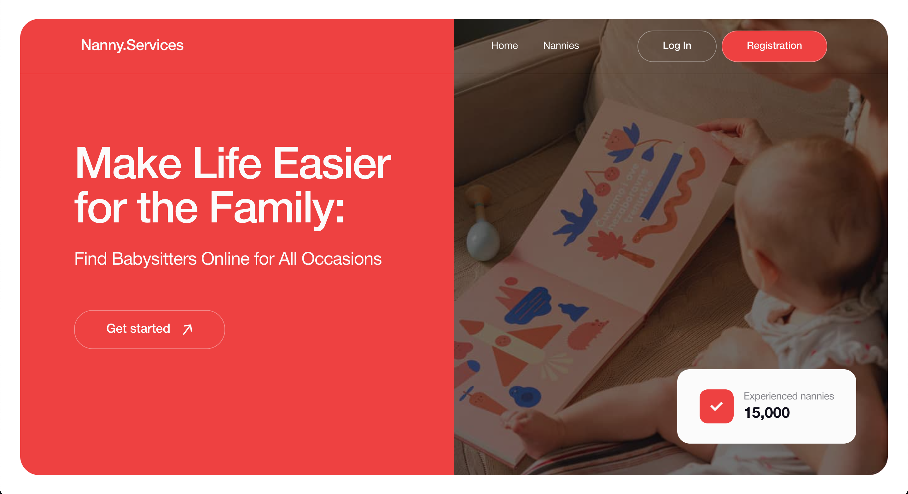
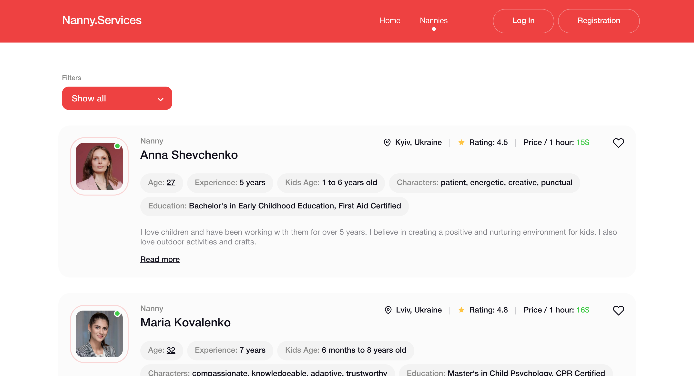

# Nanny.Services

Nanny.Services is a web application developed for a company that provides nanny hiring services. This web application helps parents find the perfect nanny for their child by providing a convenient and efficient tool for searching and selecting candidates. It consists of three main pages: "Home," "Nannies," and "Favorites."

# Technologies used

